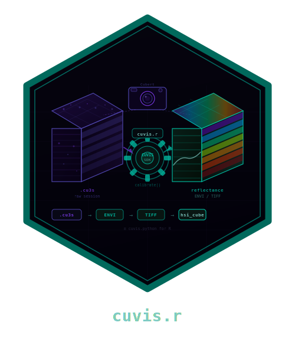

# cuvis.r 

<!-- badges: start -->
[](https://github.com/CTTIR/cuvis.r/actions/workflows/R-CMD-check.yaml)
[](https://cttir.github.io/cuvis.r/)
[](https://CRAN.R-project.org/package=cuvis.r)
[](https://app.codecov.io/gh/CTTIR/cuvis.r?branch=main)
[](https://cran.r-project.org/package=cuvis.r)
[](https://cran.r-project.org/package=cuvis.r)
[](https://opensource.org/licenses/Apache-2.0)
[](https://lifecycle.r-lib.org/articles/stages.html#experimental)
<!-- badges: end -->

**cuvis.r** provides R bindings to the [Cubert CUVIS SDK](https://cubert-hyperspectral.com/en/cuvis-sdk/)
for reading, calibrating, and exporting hyperspectral data from Cubert cameras.

This is the R equivalent of [cuvis.python](https://github.com/cubert-hyperspectral/cuvis.python).

## Prerequisites

1. **Install the Cubert CUVIS SDK** (>= 3.4.0) from [cloud.cubert-gmbh.de](https://cloud.cubert-gmbh.de/s/qpxkyWkycrmBK9m)
2. Set the `CUVIS_SDK` environment variable to the install directory
3. (Optional) Download sample data from [cloud.cubert-gmbh.de](https://cloud.cubert-gmbh.de/s/SrkSRja5FKGS2Tw)

## Installation

```r
# install.packages("remotes")
remotes::install_github("cttir/cuvis.r")
```

## Quick Start

```r
library(cuvis.r)

cuvis_init()

# Load a session file
session <- cuvis_session("path/to/measurement.cu3s")
print(session)

# Extract the data cube
mesu <- cuvis_get_measurement(session, 1)
ctx <- cuvis_processing_context(session)
cuvis_reprocess(ctx, mesu, mode = "raw")
cube <- cuvis_get_cube(mesu)
dim(cube)                        # [rows, cols, bands]
attr(cube, "wavelengths")        # wavelengths in nm

# Calibrate to reflectance
cuvis_reprocess(ctx, mesu, mode = "reflectance")
ref_cube <- cuvis_get_cube(mesu)

# Export to ENVI
cuvis_export_envi(mesu, "output/")

cuvis_shutdown()
```

## Full Calibration Workflow

```r
cuvis_init()

session <- cuvis_session("measurement.cu3s")
mesu <- cuvis_get_measurement(session, 1)

# Load separate dark/white reference files
dark_session <- cuvis_session("dark.cu3s")
white_session <- cuvis_session("white.cu3s")

ctx <- cuvis_processing_context(session)
cuvis_set_reference(ctx, cuvis_get_measurement(dark_session, 1), "dark")
cuvis_set_reference(ctx, cuvis_get_measurement(white_session, 1), "white")

cuvis_reprocess(ctx, mesu, mode = "reflectance")
ref_cube <- cuvis_get_cube(mesu)

cuvis_shutdown()
```

## API Reference

| Function | Description |
|----------|-------------|
| `cuvis_init()` | Initialize the CUVIS SDK |
| `cuvis_shutdown()` | Release SDK resources |
| `cuvis_available()` | Check if SDK is linked |
| `cuvis_session(path)` | Load a `.cu3s` session file |
| `cuvis_get_measurement(session, i)` | Extract measurement by index |
| `cuvis_get_metadata(mesu)` | Get measurement metadata |
| `cuvis_get_cube(mesu)` | Extract 3D data array |
| `cuvis_get_wavelengths(mesu)` | Get wavelength vector |
| `cuvis_processing_context(session)` | Create calibration context |
| `cuvis_set_reference(ctx, mesu, type)` | Set dark/white reference |
| `cuvis_reprocess(ctx, mesu, mode)` | Reprocess to target level |
| `cuvis_export_envi(mesu, dir)` | Export to ENVI format |
| `cuvis_export_tiff(mesu, dir)` | Export to TIFF format |
| `cuvis_export_session(mesu, dir)` | Export to .cu3s format |

## Integration with hyperspectR

cuvis.r is designed as the I/O backend for [hyperspectR](https://github.com/CTTIR/hyperspectR):

```r
library(hyperspectR)

# hyperspectR uses cuvis.r internally for .cu3s files
cube <- hs_read_cubert("measurement.cu3s")
```

## Use of LLM tools

Portions of this package were prepared with assistance from large language model tooling for
narrowly defined, non-authorial tasks: copyediting, prose smoothing, Markdown/LaTeX formatting,
scaffolding of boilerplate files (CI configs, build scripts), code refactoring. The tools used were [Chat AI](https://kisski.gwdg.de/leistungen/2-02-llm-service/),
the LLM service of KISSKI (GWDG), and a self-hosted **Mistral Small (24B, Apache-2.0)** run locally via
[Ollama](https://ollama.com/) and the `ollamar` R package — local inference only, with no data sent to
third parties for the self-hosted model.

All scientific claims, methodological choices, analyses, interpretations, and conclusions are the
author's own. No LLM-generated text was incorporated without review and revision, and every reference
was verified against its DOI, arXiv ID, or ISBN.

## License

Apache License 2.0
